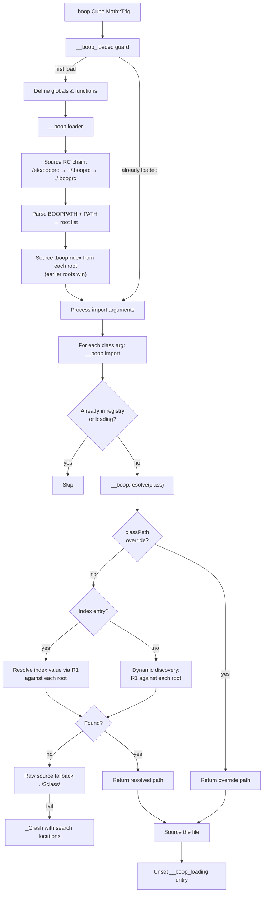
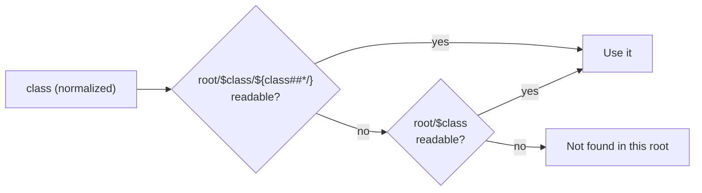
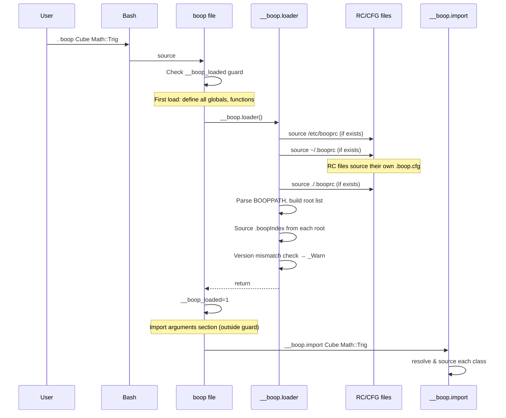

# Design Document: Classpath Namespace System

## Overview

This design replaces the current flat `__boop.import` function (which checks `__boop_classPath`, `__boop_dir`, then `PATH`) with a namespace-aware, multi-root resolution system. The new system supports `::` delimited namespaces mapped to directory hierarchies, a short-name index (`.boopIndex`) for convenient bare-name imports, RC/CFG configuration files for persistent customization, and a `boop.classPath` public API for runtime manipulation.

The core architectural change is factoring resolution into `__boop.resolve` (returns a path without sourcing) and `__boop.import` (calls resolve then sources). The effective search path becomes `.` + `BOOPPATH` + `PATH`, searched as a unified loop with deduplication. The `__boop_dir` global is dropped — the directory where `boop` lives is already on `PATH` and gets covered by the unified loop.

Key design decisions:
- `::` is normalized to `/` via string substitution. Both separators accepted.
- Resolution uses pure parameter expansion: `root/$class/${class##*/}` then `root/$class`. No segment splitting.
- Dedup via scratchpad associative array during discovery, unset when done.
- `.boopIndex` is a sourceable bash script that populates `__boop_Index`.
- Earlier roots in effective BOOPPATH take precedence for index merging.
- `boop.classPath` is the serializer — reads from and writes to the same cfg file. `_CfgFile` overrides the target.

## Architecture

### System Flow



### R1 Resolution Rule (per root)



### Bootstrap Sequence



## Components and Interfaces

### Internal Functions

#### `__boop.resolve(class)`
The resolution workhorse. Takes a class name (possibly namespaced), returns the resolved filesystem path or empty string.

```bash
# Signature
__boop.resolve() {
  local __boop_resolve_class="$1"
  # ... resolution logic ...
  # Sets __boop_resolve_result (or prints path)
}
```

**Behavior:**
1. Normalize `::` to `/` in the class name.
2. Reject empty identifiers → `_Crash`.
3. Check `__boop_classPath["$class"]` — if set and readable, return it.
4. Check `__boop_Index["$class"]` — if set, normalize the index value, then apply R1 against each root in effective BOOPPATH.
5. Dynamic discovery — apply R1 against each root in effective BOOPPATH using the (normalized) class name directly.
6. Return empty string on failure.

**Deduplication:** A scratchpad associative array tracks roots already checked. Exact-path duplicates are skipped. The scratchpad is `unset` when resolve completes.

#### `__boop.import(...classes)`
Iterates class arguments. For each:
1. Skip if in `__boop_registry` (already loaded).
2. Skip if `__boop_loading[class]` is set (circular guard).
3. Set `__boop_loading[class]=1`.
4. Call `__boop.resolve` to get the path.
5. If resolve returns a path: `. "$path"` — crash on failure, unset loading flag on success.
6. If resolve returns empty: attempt `. "$class"` as raw fallback — crash on failure.

#### `__boop.loader()`
Called once during initialization (inside the `__boop_loaded` guard). Responsibilities:
1. Source RC chain: `/etc/booprc` → `~/.booprc` → `./.booprc`. Skip missing, crash on source failure.
2. Parse `BOOPPATH` — split on `:`, skip empty segments, skip non-existent directories (emit `_Info`).
3. Build effective root list: `.` + BOOPPATH entries + PATH entries.
4. Source `.boopIndex` from each valid root. Earlier roots take precedence for duplicate short names.
5. Check `__boop_version` mismatch — emit `_Warn` if RC chain indicates a different preferred version.

### Public API

#### `boop.resolve(class)`
Public wrapper around `__boop.resolve`. Non-fatal interrogation.
- Returns exit code 0 and the path via `boop.pass` if found.
- Returns exit code 1 if not found.

```bash
if into=loc boop.resolve Math::Trig; then
  . "$loc"
fi
```

#### `boop.classPath(subcommand, ...args)`
Subcommand-dispatched public method. Registered on the `boop` class.

| Subcommand | Args | Behavior | Return |
|---|---|---|---|
| `set` | `ClassName /path` | Store in `__boop_classPath`, validate path, rewrite CFG | None (mutation) |
| `get` | `ClassName` | Look up in `__boop_classPath` | Path or empty via `boop.pass` |
| `list` | — | Dump all entries as `Class=/path` lines | Lines via `boop.pass` |
| `remove` | `ClassName` | Unset from `__boop_classPath`, rewrite CFG | None (mutation) |
| `has` | `ClassName` | Test if registered | Exit code 0/1 only |
| `dirs` | — | List effective root search order | Lines via `boop.pass` |
| `rebuild` | — | Scan namespace tree, regenerate `.boopIndex` | None (mutation) |

**CFG serialization:** `set` and `remove` rewrite the target CFG file as a complete serialization of `__boop_classPath`. Default target: `~/.boop.cfg`. Override via `_CfgFile` environment variable.

### New Global Variables

| Variable | Type | Purpose |
|---|---|---|
| `__boop_Index` | `declare -gA` | Short-name → namespace-path index (merged from all roots) |
| `__boop_version` | `declare -gr` | Framework version string (for mismatch detection) |
| `__boop_roots` | (transient) | Effective root list, built during loader, used during resolution |

### Modified Globals

| Variable | Change |
|---|---|
| `__boop_dir` | **Removed.** No longer needed — the directory where `boop` lives is on `PATH` and covered by the unified root loop. |
| `__boop_classPath` | Unchanged declaration. Now populated by RC/CFG chain and `boop.classPath set`. |

## Data Models

### Effective BOOPPATH (Root List)

An ordered array of directory paths, constructed during `__boop.loader`:

```
[0] = "."                          # current working directory
[1] = "/home/user/boop-libs"       # first BOOPPATH entry
[2] = "/opt/boop/v2"               # second BOOPPATH entry
[3] = "/usr/local/bin"             # first PATH entry
[4] = "/usr/bin"                   # second PATH entry
...
```

Duplicates are skipped during construction. The list is ephemeral — built for each resolution call from the current `BOOPPATH` and `PATH` values.

### `.boopIndex` File Format

A sourceable bash script at each library root:

```bash
# .boopIndex — auto-generated by boop.classPath rebuild
declare -gA __boop_Index=(
  [Container]="Collection/Container"
  [List]="Collection/List"
  [Map]="Collection/Map"
  [Math]="Math"
  [Trig]="Math/Trig"
  [Card]="Games/Card"
  [Deck]="Games/Deck"
)
```

Values are normalized paths (using `/`, not `::`). When sourced, entries merge into the in-memory `__boop_Index`. Earlier roots take precedence — if a short name is already set when a later root's index is sourced, the later entry is ignored.

**Conflict handling during rebuild:** If two namespaces within the same root define a class with the same short name (e.g., `IO/Util` and `Math/Util` both have `Util`), that short name is excluded from the generated index. An `_Info` diagnostic lists the conflicting namespaces.

### `.boop.cfg` File Format

Machine-managed, complete serialization of `__boop_classPath`:

```bash
# Auto-generated by boop.classPath — do not edit manually
__boop_classPath["MyUtils"]="/home/user/lib/MyUtils"
__boop_classPath["GameEngine"]="/opt/boop-libs/GameEngine"
```

Rewritten in full on every mutation (`set`, `remove`). No procedural logic — only hash assignments.

### `.booprc` File Format

Human-editable bash script. Responsible for sourcing its co-located `.boop.cfg`:

```bash
# ~/.booprc
[[ -f ~/.boop.cfg ]] && . ~/.boop.cfg

# User customizations
BOOPPATH="/home/user/boop-libs:/opt/boop/v2"
_LogLevel debug Math
```

### Class Resolution Data Flow

```
Input: "Collection::List"
  ↓ normalize :: → /
Normalized: "Collection/List"
  ↓ check __boop_classPath["Collection/List"] → miss
  ↓ check __boop_Index["Collection/List"] → miss
  ↓ dynamic discovery, root = "."
    ↓ try "./Collection/List/List" → miss
    ↓ try "./Collection/List" → miss
  ↓ dynamic discovery, root = "/usr/local/lib/boop"
    ↓ try "/usr/local/lib/boop/Collection/List/List" → HIT (readable file)
Result: "/usr/local/lib/boop/Collection/List/List"
```

```
Input: "List"
  ↓ normalize (no :: present, unchanged)
Normalized: "List"
  ↓ check __boop_classPath["List"] → miss
  ↓ check __boop_Index["List"] → "Collection/List"
  ↓ resolve "Collection/List" via R1 against each root
    ↓ root = ".", try "./Collection/List/List" → miss
    ↓ root = "/usr/local/lib/boop", try ".../Collection/List/List" → HIT
Result: "/usr/local/lib/boop/Collection/List/List"
```


## Correctness Properties

*A property is a characteristic or behavior that should hold true across all valid executions of a system — essentially, a formal statement about what the system should do. Properties serve as the bridge between human-readable specifications and machine-verifiable correctness guarantees.*

### Property 1: Namespace normalization preserves content

*For any* string containing `::` separators, after normalization the result SHALL contain no `::` sequences, every `::` SHALL have been replaced with `/`, and all non-`::` content SHALL be preserved in its original order and form.

**Validates: Requirements 1.1**

### Property 2: R1 resolution prefers namespace convention over bare file

*For any* class path string and library root directory, if `root/$class/${class##*/}` exists and is a readable file, R1 SHALL return that path. If only `root/$class` exists and is a readable file, R1 SHALL return that path. If neither exists, R1 SHALL return nothing for that root.

**Validates: Requirements 1.2, 1.3**

### Property 3: Resolution priority chain is strict

*For any* class name, if `__boop_classPath` contains an entry for it, `__boop.resolve` SHALL return that entry's path regardless of what exists in the index or on the filesystem. If no classPath entry exists but `__boop_Index` contains an entry, resolve SHALL use the index value for R1 resolution before attempting dynamic discovery. Dynamic discovery SHALL only be attempted when both classPath and index lookups fail.

**Validates: Requirements 2.3, 2.6, 2.7**

### Property 4: Effective BOOPPATH construction order

*For any* combination of `BOOPPATH` and `PATH` environment variable values, the effective root list SHALL begin with `.` (current directory), followed by each non-empty `BOOPPATH` entry in left-to-right order, followed by each `PATH` entry in left-to-right order. Empty segments from `BOOPPATH` SHALL be filtered out.

**Validates: Requirements 2.4, 8.1, 8.3, 14.1, 14.2**

### Property 5: Root deduplication uses exact path matching only

*For any* effective root list, during dynamic discovery each unique root path SHALL be checked at most once. A root SHALL be considered a duplicate only if it is the exact same string as a previously checked root. A root that is a subdirectory of a previously checked root SHALL NOT be treated as a duplicate.

**Validates: Requirements 2.5**

### Property 6: Load guards prevent redundant and circular loading

*For any* class name, if it is already in `__boop_registry` OR has `__boop_loading` set to 1, `__boop.import` SHALL skip resolution entirely. After a class file is successfully sourced, `__boop_loading` for that class SHALL be unset.

**Validates: Requirements 2.2, 3.1, 3.2, 3.3**

### Property 7: Index rebuild round-trip

*For any* namespace tree at a library root, running `boop.classPath rebuild` and then sourcing the generated `.boopIndex` SHALL populate `__boop_Index` with a mapping from each unambiguous short name to its correct namespace path. The generated file SHALL be valid sourceable bash.

**Validates: Requirements 4.2, 5.1, 15.1, 15.2**

### Property 8: Index precedence — earlier roots win

*For any* short name defined in the `.boopIndex` files of multiple library roots, after all indexes are sourced during initialization, `__boop_Index` SHALL contain the value from the first root in the effective BOOPPATH that defines that short name.

**Validates: Requirements 4.4, 8.4**

### Property 9: Index conflict exclusion during rebuild

*For any* library root where two or more namespaces define a class with the same short name, `boop.classPath rebuild` SHALL exclude that short name from the generated `.boopIndex`. All non-conflicting short names SHALL still be present.

**Validates: Requirements 5.2, 15.4**

### Property 10: Index is a declaration, not a cache

*For any* class resolved via filesystem fallback (dynamic discovery), the `.boopIndex` file SHALL remain unchanged after resolution. Filesystem fallback hits SHALL NOT auto-update the index.

**Validates: Requirements 5.4**

### Property 11: CFG serialization round-trip

*For any* sequence of `boop.classPath set` and `boop.classPath remove` operations, the target CFG file SHALL be a complete serialization of the current `__boop_classPath` state. Sourcing the CFG file into a clean `__boop_classPath` SHALL reproduce the exact same set of key-value pairs. The CFG file SHALL contain only `__boop_classPath` hash assignments and no procedural logic.

**Validates: Requirements 7.1, 7.2, 9.5, 12.2**

### Property 12: ClassPath registry behaves as a correct key-value store

*For any* sequence of `set`, `get`, `remove`, and `has` operations on the classPath registry: `get` after `set(k, v)` SHALL return `v`; `has` after `set(k, v)` SHALL return exit code 0; `get` after `remove(k)` SHALL return empty string; `has` after `remove(k)` SHALL return exit code 1. `list` SHALL include every currently registered entry formatted as `ClassName=/path`.

**Validates: Requirements 9.1, 10.1, 10.2, 11.1, 12.1, 13.1, 13.2**

### Property 13: BOOPPATH parsing filters empty segments

*For any* `BOOPPATH` string, parsing SHALL split on `:` delimiters and produce only non-empty segments. Leading colons, trailing colons, and consecutive colons SHALL not produce empty entries in the parsed result.

**Validates: Requirements 8.1, 8.3**

## Error Handling

### Resolution Failures

| Condition | Handler | Message |
|---|---|---|
| Empty class identifier | `_Crash` | "Empty class identifier" |
| `__boop_classPath` path not readable | `_Crash` | "Failed to load class 'X' from /path" |
| Source of resolved file fails | `_Crash` | "Failed to load class 'X' from /path" |
| All resolution steps exhausted | `_Crash` | "Class 'X' not found (checked classPath, index, roots: ...)" |

### Bootstrap Failures

| Condition | Handler | Message |
|---|---|---|
| RC file exists but fails to source | `_Crash` | "Failed to source /path/to/booprc" |
| Version mismatch detected | `_Warn` | "Loaded boop vX but /path/to/booprc prefers vY" |
| BOOPPATH entry is non-existent directory | `_Info` | "BOOPPATH entry '/path' does not exist, skipping" |

### ClassPath API Failures

| Condition | Handler | Message |
|---|---|---|
| `set` with empty class name | `_Crash` | "boop.classPath set: class name required" |
| `set` with non-readable path | `_Crash` | "boop.classPath set: '/path' is not a readable file" |
| `set` overwrites existing entry | `_Info` | "boop.classPath set: overwriting 'X' (was /old, now /new)" |
| `remove` for unregistered class | `_Info` | "boop.classPath remove: 'X' is not registered" |
| Unknown subcommand | `_Crash` | "boop.classPath: unknown subcommand 'X'" |

### Diagnostic Suggestions

| Condition | Level | Message |
|---|---|---|
| Class resolved via filesystem fallback | `_Info` | "'X' resolved via filesystem fallback — consider running `boop.classPath rebuild`" |
| Short-name conflict during rebuild | `_Info` | "Short name 'X' conflicts: A/X and B/X — excluded from index" |

## Testing Strategy

### Unit Tests (Example-Based)

Unit tests cover specific scenarios, edge cases, integration points, and error conditions:

- **Bootstrap ordering:** RC chain sources before import arguments are processed (R2.1)
- **RC file precedence:** later tiers override earlier tiers (R6.1)
- **Missing RC/CFG files:** silently skipped (R6.2, R7.5)
- **RC source failure:** crashes with file path (R6.4)
- **Version mismatch warning:** emitted when versions differ (R6.5)
- **Non-existent BOOPPATH entries:** _Info emitted, entry skipped (R8.2)
- **Empty class name on set:** crashes (R9.2)
- **Non-readable path on set:** crashes (R9.3)
- **Overwrite notification on set:** _Info emitted (R9.4)
- **Remove of unregistered class:** _Info emitted, no crash (R12.3)
- **Empty registry on list:** returns empty string (R11.2)
- **Unregistered class on get:** returns empty string (R10.2)
- **Filesystem fallback diagnostic:** _Info suggests rebuild (R5.5)
- **Conflict diagnostic during rebuild:** _Info lists conflicting namespaces (R5.3)
- **Return convention:** get/list/dirs use boop.pass; has uses exit code only; set/remove/rebuild return no value (R16.1, R16.2, R16.3)
- **Raw source fallback:** attempted when all other steps fail (R2.8)
- **Complete resolution failure:** _Crash with class name and searched locations (R2.9)
- **Source failure:** _Crash with class name and file path (R3.4)
- **Empty identifier rejection:** _Crash on empty or whitespace-only input (R1.4)
- **CFG file override via _CfgFile:** writes to specified path (R7.3, R7.4)

### Property-Based Tests

Property-based tests verify universal properties across generated inputs. Each property test runs a minimum of 100 iterations.

The testing library for bash property-based testing will need to be a lightweight custom harness (bash lacks a standard PBT library), or the properties can be tested via a test driver that generates random inputs and asserts invariants in a loop. The existing `TestSuite` class in the framework can be extended to support iteration-based property tests.

Each property test references its design document property:

| Property | Test Description | Generator Strategy |
|---|---|---|
| P1: Namespace normalization | Generate random strings with `::`, `/`, single `:`, and other characters. Verify normalization output. | Random strings with mixed separators |
| P2: R1 resolution rule | Create temp directory trees with namespace convention and/or bare files. Verify R1 returns the correct path. | Random class names + random filesystem layouts |
| P3: Resolution priority | Set up classPath overrides, index entries, and filesystem files. Verify the highest-priority source wins. | Random class names with varying resolution sources |
| P4: Effective BOOPPATH construction | Generate random BOOPPATH and PATH strings. Verify root list order. | Random colon-separated path strings |
| P5: Root deduplication | Generate root lists with exact duplicates and subdirectory relationships. Verify dedup behavior. | Random directory paths with intentional duplicates |
| P6: Load guards | Pre-populate registry and loading flags. Verify import skips correctly and cleans up. | Random class names |
| P7: Index rebuild round-trip | Create random namespace trees. Run rebuild, source index, verify mappings. | Random directory hierarchies with class files |
| P8: Index precedence | Create multiple roots with overlapping short names. Verify first root wins. | Random short names across random root orderings |
| P9: Index conflict exclusion | Create roots with intentional short-name conflicts. Verify exclusion. | Random namespace trees with duplicate short names |
| P10: Index is declaration | Resolve via fallback, verify index file unchanged. | Random class names resolved via filesystem |
| P11: CFG serialization round-trip | Perform random set/remove sequences. Verify CFG round-trips. | Random class name/path pairs, random operation sequences |
| P12: ClassPath registry correctness | Perform random set/get/remove/has sequences. Verify key-value store semantics. | Random class names and paths, random operation sequences |
| P13: BOOPPATH parsing | Generate BOOPPATH strings with edge cases (empty segments, colons). Verify parsing. | Random path strings with intentional empty segments |

### Test Configuration

- Property tests: minimum 100 iterations per property
- Tag format: `Feature: classpath-namespace-system, Property {N}: {title}`
- Test files use temp directories for filesystem isolation — no side effects on the real filesystem
- Each test creates and tears down its own directory tree
- Tests source `boop` in a subshell to avoid polluting the test runner's environment
